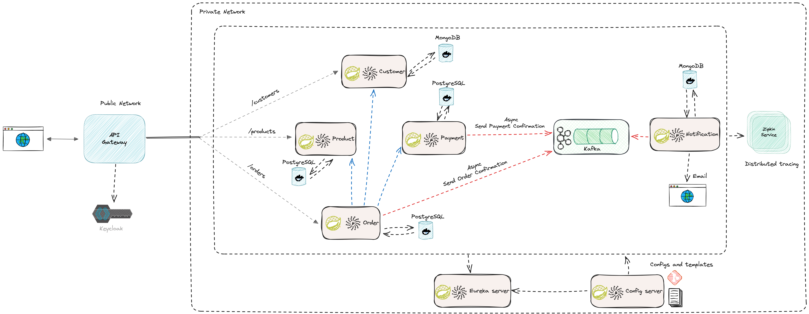

## E-Commerce Microservices Architecture


## Project Overview
This project is an e-commerce platform built using a Microservices Architecture. It leverages various design patterns and technologies to ensure scalability, maintainability, and robustness.

## Key Features
- **Service Registry and Discovery**: Enables dynamic discovery of services using a registry.
- **API Gateway**: Acts as a single entry point for all client requests, providing routing, security, and load balancing.
- **CQRS (Command Query Responsibility Segregation)**: Separates read and write operations to optimize performance and scalability.
- **Database per Service**: Each microservice has its own database, ensuring loose coupling and independent scaling.
- **Event-driven Architecture**: Uses Apache Kafka for asynchronous communication between services.

## Technologies Used
- **Java**: The primary programming language for the microservices.
- **Spring Boot**: Framework for building microservices.
- **Maven**: Dependency management and build tool.
- **PostgreSQL**: Relational database for data storage.
- **MongoDB**: NoSQL database for specific microservices.
- **Zookeeper**: Coordination service for distributed systems.
- **Apache Kafka**: Messaging system for event-driven architecture.
- **Docker**: Containerization of microservices.
- **Docker Compose**: Tool for defining and running multi-container Docker applications.
- **Keycloak**: Identity and access management.
- **MailDev**: SMTP server for development and testing.

## Microservices
- **API Gateway**: Acts as a single entry point for all client requests.
- **Service Registry**: Registers and discovers services.
- **Config Server**: Centralized configuration management.
- **Product Service**: Manages product information.
- **Order Service**: Handles order processing and management.
- **Customer Service**: Manages user information and authentication.
- **Payment Service**: Processes payments.
- **Notification Service**: Sends notifications to users.

## Running the Project
1. Clone the repository:
   ```sh
   git clone https://github.com/sabit-shaiholla/ecommerce-microservices.git
   cd ecommerce-microservices
2. Run the following command to start the services:
   ```sh
   docker-compose up -d
3. Build and run microservices in following way:
   ```sh
   cd <microservice-name>
   mvn clean install
   mvn spring-boot:run
   ```
   **Note**: Firstly run the Config Server, Service Registry, and API Gateway. Then run the remaining microservices.

4. Access the services using the following URLs:
    - **API Gateway**: http://localhost:8222
    - **Eureka Service Registry**: http://localhost:8761
    - **PgAdmin**: http://localhost:5050
    - **PostgreSQL**: http://localhost:5432
    - **Keycloak**: http://localhost:9098
    - **MailDev**: http://localhost:8082
    - **MongoDB**: http://localhost:27017
    - **Mongo Express**: http://localhost:8081
    - **Kafka**: http://localhost:9092
    - **Zikpin**: http://localhost:9411

## Contributing
Contributions are welcome! Please fork the repository and submit a pull request.

## License
This project is licensed under the MIT License - see the [LICENSE](LICENSE) file for details.